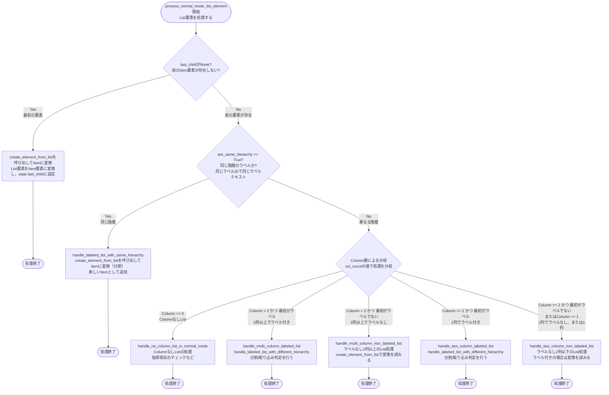
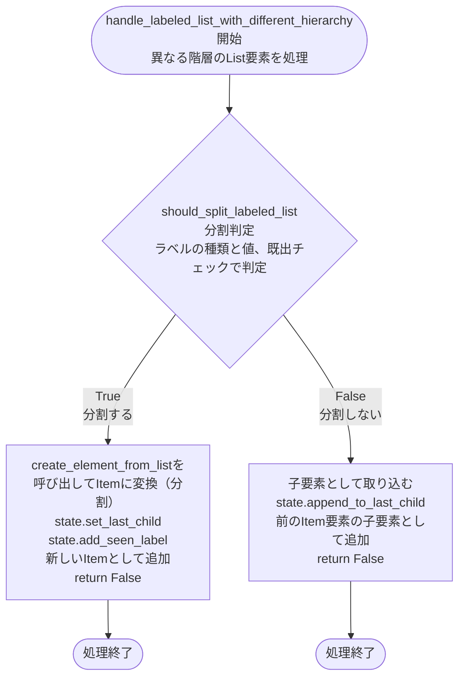
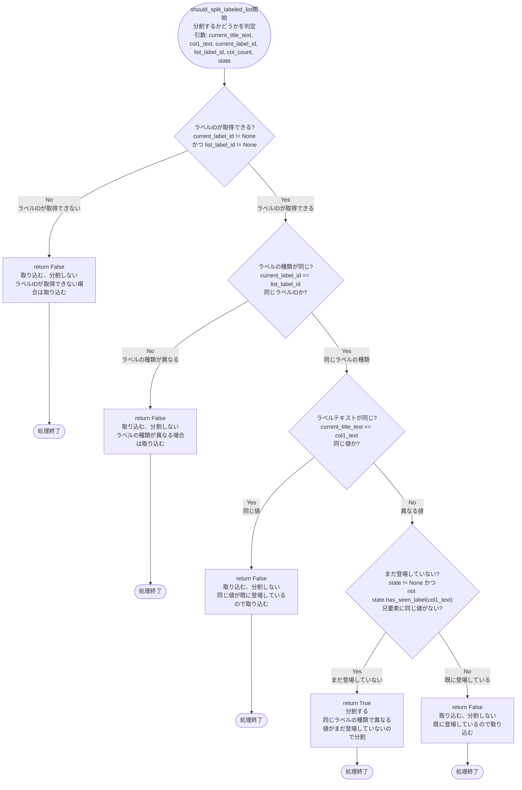
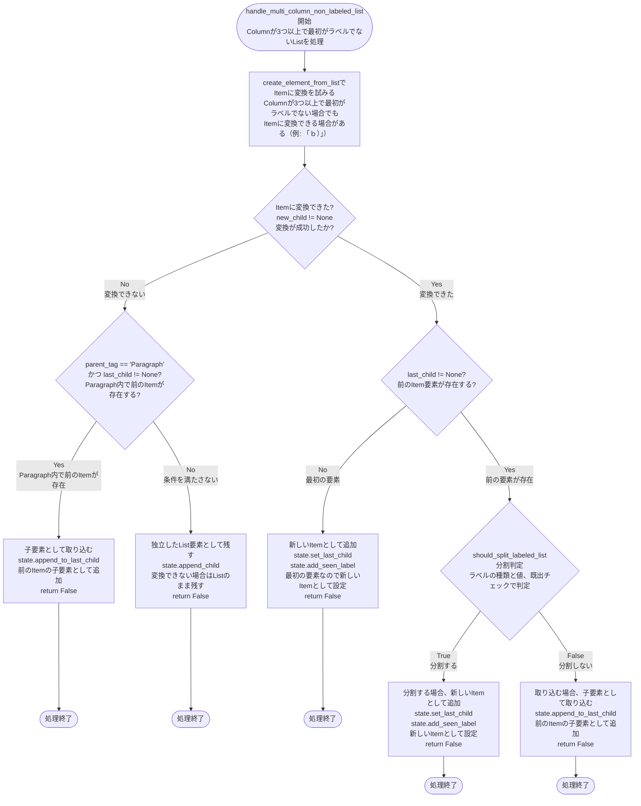
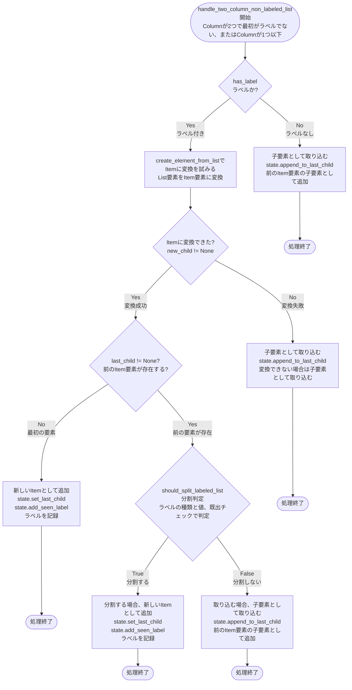

# xml_converter.py 処理フローチャート

## ラベル付きList要素の処理フロー（NORMAL_PROCESSINGモード）

### 全体フロー

**処理の説明:**

- **CheckLastChild**: `state.last_child`が`None`かどうかをチェック。最初の要素の場合は`None`。
- **CreateFirst**: 最初の要素の場合は、`create_element_from_list`でItemに変換し、`state.last_child`に設定。
- **CheckSameHierarchy**: `are_same_hierarchy`関数で、現在のItemと新しいListが同じ階層（同じラベルIDで同じラベルテキスト）かチェック。
- **HandleSameHierarchy**: 同じ階層の場合は、新しいItemとして分割（`create_element_from_list`で変換）。
- **CheckColumnCount**: Column数（`col_count`）と最初のColumnがラベルかどうかで処理を分岐。
- **HandleMultiLabeled**: Columnが3つ以上で最初がラベルの場合、`handle_labeled_list_with_different_hierarchy`で分割/取り込み判定。
- **HandleMultiNonLabeled**: Columnが3つ以上で最初がラベルでない場合、`create_element_from_list`で変換を試みる。
- **HandleTwoLabeled**: Columnが2つで最初がラベルの場合、`handle_labeled_list_with_different_hierarchy`で分割/取り込み判定。
- **HandleTwoNonLabeled**: Columnが2つで最初がラベルでない場合、またはColumnが1つの場合の処理。ラベル付きの場合は変換を試みる。

### handle_labeled_list_with_different_hierarchy の詳細フロー

**処理の説明:**

- **SplitCheck**: `should_split_labeled_list`関数で分割するかどうかを判定。以下のルールに基づいて判定：
  1. 同じラベルの種類でかつ同じ値がまだ登場していない（兄要素にない）：分割する
  2. 同じラベルの種類でかつ、同じ値がすでに登場している：取り込む
  3. ラベルの種類が異なる：取り込む
- **Split**: 分割する場合、`create_element_from_list`でItemに変換し、`state.set_last_child`で新しいItemとして設定。`state.add_seen_label`でラベルを記録。
- **AppendDefault**: 分割しない場合、`state.append_to_last_child`で子要素として取り込む。

### should_split_labeled_list の詳細フロー

**処理の説明:**

- **CheckLabelId**: ラベルIDが取得できるかどうかをチェック。`current_label_id`または`list_label_id`が`None`の場合は取り込む。
- **ReturnFalse1**: ラベルIDが取得できない場合、取り込む（分割しない）。
- **CheckLabelType**: ラベルの種類（ラベルID）が同じかどうかをチェック。`current_label_id == list_label_id`で判定。
- **ReturnFalse2**: ラベルの種類が異なる場合、取り込む（分割しない）。ルール3に基づく。
- **CheckSameValue**: 同じラベルの種類の場合、ラベルテキスト（値）が同じかどうかをチェック。`current_title_text == col1_text`で判定。
- **ReturnFalse3**: 同じ値の場合、取り込む（分割しない）。ルール2に基づく。
- **CheckSeenLabel**: 異なる値の場合、まだ登場していないかどうかをチェック。`state.has_seen_label(col1_text)`で判定。
- **ReturnTrue**: まだ登場していない場合、分割する。ルール1に基づく。
- **ReturnFalse4**: 既に登場している場合、取り込む（分割しない）。ルール2に基づく。

### handle_multi_column_non_labeled_list の詳細フロー

**処理の説明:**

- **CreateElement**: `create_element_from_list`関数でItemに変換を試みる。Columnが3つ以上で最初がラベルでない場合でも、Itemに変換できる場合がある（例: 「ｂ）」は`is_label`が`False`を返すが、`create_element_from_list`でItemに変換される）。
- **CheckCreated**: `create_element_from_list`の戻り値（`new_child`）が`None`でないかどうかをチェック。変換が成功したかどうかを判定。
- **CheckParent**: Itemに変換できない場合、`parent_tag`が`'Paragraph'`で、`state.last_child`が`None`でないかどうかをチェック。Paragraph内で前のItemが存在するかどうかを判定。
- **AppendChild1**: Paragraph内で前のItemが存在する場合、子要素として取り込む。
- **AppendChild2**: 条件を満たさない場合、独立したList要素として残す。
- **CheckLastChild**: Itemに変換できた場合、`state.last_child`が`None`でないかどうかをチェック。前のItem要素が存在するかどうかを判定。
- **SetLastChild1**: 前のItem要素が存在しない場合（最初の要素）、新しいItemとして追加。
- **SplitCheck**: 前のItem要素が存在する場合、`should_split_labeled_list`で分割するかどうかを判定。ラベルの種類と値、既出チェックで判定。
- **SetLastChild2**: 分割する場合、新しいItemとして追加。
- **AppendChild3**: 分割しない場合、子要素として取り込む。

### handle_two_column_non_labeled_list の詳細フロー

**処理の詳細:**

1. **ラベル付きListのチェック**
   - `has_label`が`True`（`is_label_text(col1_text, col_count)`が`True`）の場合：
     - `create_element_from_list`でItemに変換を試みる
     - 変換できた場合（`new_child != None`）：
       - 前のItem要素が存在する場合、`should_split_labeled_list`で分割/取り込み判定を行う
       - 分割する場合、`state.set_last_child(new_child)`で新しいItemとして追加
       - 分割しない場合、`state.append_to_last_child(child)`で子要素として取り込む
       - 前のItem要素が存在しない場合、`state.set_last_child(new_child)`で新しいItemとして追加
     - 変換できなかった場合：
       - `state.append_to_last_child(child)`で子要素として取り込む

2. **ラベルなしListの場合**
   - `state.append_to_last_child(child)`で子要素として取り込む
   - 前のItem要素の子要素として追加される

**重要なポイント:**

- **呼び出し条件**: この関数は、`is_label(col1_text)`が`False`かつ`is_kanji_number_label(col1_text)`が`False`の場合に呼び出されます
- **`has_label`の値**: `has_label`は`is_label_text(col1_text, col_count)`の結果で、`is_label_text`は`is_label(text) or is_kanji_number_label(text)`を返します
- **分割判定**: ラベル付きListでItemに変換できた場合、`should_split_labeled_list`で分割/取り込み判定を行う。ラベルの種類と値、既出チェックで判定。

**使用例:**
- Columnが2つで最初がテキスト（例: 「テキスト1」「テキスト2」）の場合、子要素として取り込まれます
- Columnが1つの場合、子要素として取り込まれます
- Columnが2つで最初がラベルだが`is_label`が`False`を返す場合でも、`has_label`が`True`の場合は変換を試みます

## 処理の優先順位

### handle_labeled_list_with_different_hierarchy の処理順序

1. **分割判定**（`should_split_labeled_list`）
   - ラベルの種類と値、既出チェックで判定
   - 同じラベルの種類でかつ同じ値がまだ登場していない（兄要素にない）：分割する
   - 同じラベルの種類でかつ、同じ値がすでに登場している：取り込む
   - ラベルの種類が異なる：取り込む

2. **それ以外**
   - デフォルトで取り込む

### handle_multi_column_non_labeled_list の処理順序

1. **create_element_from_listでItemに変換を試みる**
   - Columnが3つ以上で最初がラベルでない場合でも、Itemに変換できる場合がある

2. **Itemに変換できた場合、分割/取り込み判定**
   - `should_split_labeled_list`で分割/取り込み判定を行う
   - ラベルの種類と値、既出チェックで判定

3. **Itemに変換できない場合**
   - 子要素として取り込む

### handle_two_column_non_labeled_list の処理順序

1. **ラベル付きListの場合は変換を試みる**
   - `create_element_from_list`でItemに変換を試みる

2. **Itemに変換できた場合、分割/取り込み判定**
   - `should_split_labeled_list`で分割/取り込み判定を行う
   - ラベルの種類と値、既出チェックで判定

3. **ラベルなしListの場合**
   - 子要素として取り込む

## 重要なポイント

- **ラベルの種類による処理の統一**
  - アルファベットラベル、数字ラベル、その他のラベルに関わらず、同じルールで処理される
  - ラベルの種類が異なる場合は常に取り込む
  - 同じラベルの種類で同じ値が既に登場している場合は取り込む
  - 同じラベルの種類で異なる値がまだ登場していない場合は分割する

- **Column数は処理の分岐にのみ使用される**
  - Column数によって、どのハンドラー関数を呼び出すかを決定する
  - ただし、最終的な分割/取り込み判定は`should_split_labeled_list`で統一されている

- **既出ラベルのチェック**
  - `state.has_seen_label(col1_text)`で、同じ値のラベルが既に登場しているかどうかをチェック
  - 既に登場している場合は取り込む（分割しない）

- **ラベルIDが取得できない場合**
  - `detect_label_id`が`None`を返す場合、取り込む（分割しない）
